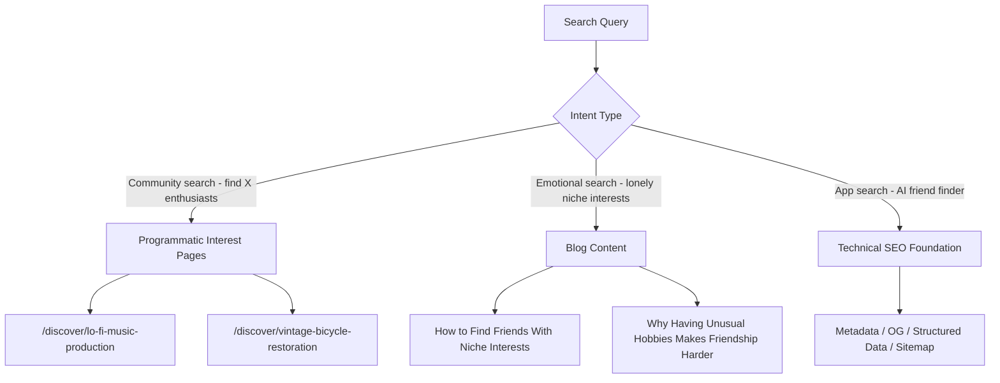
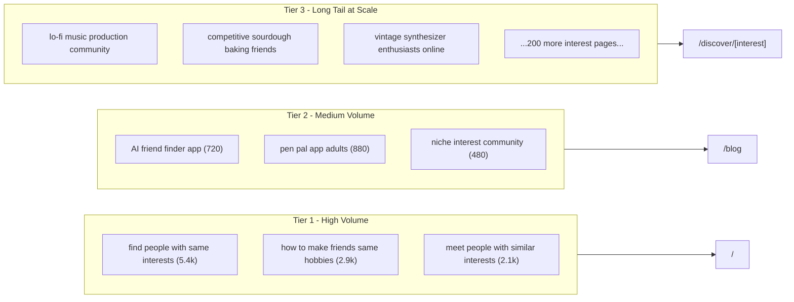

# Wavelength SEO Strategy

## The Core Insight

The people Wavelength is built for are *already searching*. Every day, someone types "find people who like lo-fi music production" or "why is it hard to make friends when you have weird hobbies" or "community for competitive sourdough bakers." These searches have no good destination right now. Wavelength should be that destination — not by gaming Google, but by building the actual pages those searches deserve.

---

## Three Pillars




---

## Pillar 1 — Technical SEO Foundation

All public pages currently expose only a bare title and description. The following files need to be created or expanded.

### Files to create

`**[web/app/sitemap.ts](web/app/sitemap.ts)**` — Dynamic XML sitemap

- Includes all static routes (`/`, `/login`, `/register`, `/discover`, `/blog`)
- Includes all programmatic interest slugs (generated from the seed data file)
- Includes all blog post slugs
- Sets `priority` and `changeFrequency` per page type

`**[web/app/robots.ts](web/app/robots.ts)**` — Robots.txt

- `Allow: /`, `/discover/*`, `/blog/*`
- `Disallow: /dashboard`, `/profile`, `/connections`, `/settings`, `/onboarding`, `/api`
- Points to sitemap URL

`**[web/app/opengraph-image.tsx](web/app/opengraph-image.tsx)**` — Static fallback OG image (dark theme, Wavelength wordmark, tagline)

### Files to modify

`**[web/app/layout.tsx](web/app/layout.tsx)**` — Expand the `metadata` export:

```ts
export const metadata: Metadata = {
  title: { default: 'Wavelength', template: '%s | Wavelength' },
  description: 'Find your people through the power of shared interests. AI-powered matching for people with niche, specific, and unusual interests.',
  metadataBase: new URL('https://wavelength.app'),
  keywords: ['find friends with same interests', 'niche interest community', 'AI friend finder', 'meet people with similar hobbies', 'pen pal app'],
  openGraph: {
    type: 'website',
    siteName: 'Wavelength',
    title: 'Wavelength — Find Your People',
    description: '...',
    images: ['/opengraph-image'],
  },
  twitter: { card: 'summary_large_image', ... },
}
```

Also add a **JSON-LD structured data** block (`SoftwareApplication` schema) inside `<body>`:

```html
<script type="application/ld+json">
{
  "@type": "SoftwareApplication",
  "name": "Wavelength",
  "applicationCategory": "SocialNetworkingApplication",
  "description": "AI-powered matching for people with niche interests..."
}
</script>
```

`**[web/app/page.tsx](web/app/page.tsx)**` — Add `export const metadata` for the landing page targeting primary keywords: "find people with same interests", "AI friend finder app", "meet people with niche hobbies".

---

## Pillar 2 — Programmatic Interest Pages (The Scale Play)

This is the highest-leverage SEO investment. Airbnb, Glassdoor, and Yelp all used programmatic page generation to dominate long-tail search at scale. Wavelength should do the same for interest communities.

### The mechanic

Every niche interest is a search cluster. Someone searching "competitive sourdough baking community" has no great destination today. A page at `/discover/competitive-sourdough-baking` that says *"Find people who are obsessed with competitive sourdough baking — Wavelength uses AI to match you with others who share the same depth of interest"* directly answers that query.

### Search queries captured per page

- `[interest] community online`
- `find people who like [interest]`
- `[interest] friends online`
- `[interest] pen pal`
- `meet [interest] enthusiasts`

At 200 interest pages, this captures thousands of long-tail query variations that individually have modest volume but collectively represent the entire addressable audience.

### Files to create

`**[web/lib/interests.ts](web/lib/interests.ts)`** — Seed data: ~200 niche interests with slug, display name, category, and a 2–3 sentence description. Organized into clusters (music, food, making/crafting, literature, gaming, science, outdoor, etc.). Example:

```ts
export const interests = [
  {
    slug: 'lo-fi-music-production',
    name: 'Lo-Fi Music Production',
    category: 'Music',
    description: 'Creating music with warm, imperfect textures...',
    related: ['vintage-synthesizers', 'sample-flipping', 'bedroom-pop'],
  },
  ...
]
```

`**[web/app/discover/[interest]/page.tsx](web/app/discover/[interest]/page.tsx)**` — Dynamic route with:

- `generateStaticParams()` — builds all pages at compile time from `interests.ts`
- `generateMetadata()` — unique title/description/OG per interest
- Page content: hero ("Find your [interest] people"), explanation of AI matching, CTA, related interests (for internal linking)
- `notFound()` fallback for unknown slugs
- JSON-LD `ItemList` schema listing related interests

`**[web/app/discover/page.tsx](web/app/discover/page.tsx)**` — Public index of all interests, grouped by category. This acts as a hub page with outbound links to every interest page — critical for crawl discovery and PageRank flow.

`**[web/app/discover/[interest]/opengraph-image.tsx](web/app/discover/[interest]/opengraph-image.tsx)**` — Dynamic OG image showing "Find your [interest] people on Wavelength" — makes social shares from these pages look polished and interest-specific.

---

## Pillar 3 — High-Intent Blog Content

Target the emotional search queries that are high-intent but unbranded. These rank quickly because the competition is weak (most results are generic Reddit threads or listicles from 2019).

### Files to create

`**[web/app/blog/page.tsx](web/app/blog/page.tsx)**` — Blog index with `metadata`

`**[web/app/blog/[slug]/page.tsx](web/app/blog/[slug]/page.tsx)**` — Blog post template with:

- `generateMetadata()` reading frontmatter from MDX
- JSON-LD `BlogPosting` schema
- Estimated read time, published date
- CTA widget at the end ("Try Wavelength free →")

`**[web/content/posts/](web/content/posts/)**` — MDX post files. Ten priority posts:


| Priority | Target Query (monthly searches)                                | Post Title                                                              |
| -------- | -------------------------------------------------------------- | ----------------------------------------------------------------------- |
| 1        | "find people with niche interests" (5,400/mo)                  | How to Find People Who Share Your Specific Interests in 2026            |
| 2        | "how to make friends as introvert" (8,100/mo)                  | The Introvert's Guide to Finding Real Friends Online                    |
| 3        | "apps to meet people with same hobbies" (1,900/mo)             | The Best Apps for Meeting People With the Same Hobbies (Honest Review)  |
| 4        | "online pen pal for adults" (880/mo)                           | Modern Pen Pals: How to Find a Real Intellectual Correspondence Partner |
| 5        | "niche hobby community" (1,300/mo)                             | Why Your Niche Hobby Community Doesn't Exist Yet (And How to Build It)  |
| 6        | "AI friend finder" (720/mo, fast-growing)                      | How AI Is Changing the Way People Find Friends                          |
| 7        | "feeling lonely with unusual interests" (low vol, high intent) | On Loneliness and the Strange Comfort of Niche Obsessions               |
| 8        | "reddit find friends same interests" (1,200/mo)                | Why Reddit Is Bad at Making Friends (And What to Do Instead)            |
| 9        | Dev/HN audience — drives backlinks                             | How We Use Vector Embeddings to Match Humans, Not Products              |
| 10       | Dev/HN audience — drives backlinks                             | Building a Semantic Similarity Search Engine With pgvector              |


Posts 9 and 10 are written for Hacker News / dev.to and generate backlinks from engineering audiences — the highest-quality backlinks available in this category.

---

## Keyword Architecture




---

## Off-Page Distribution (Amplify the SEO)

These aren't code changes but are essential for the strategy to work:

- **ProductHunt launch** — day-one backlinks from a high-DA site; submit under "Social & Networking" + "AI Tools"
- **Hacker News Show HN** — technical posts 9 & 10 are designed to get upvoted here; each HN front-page hit generates ~50+ backlinks from bloggers and devs
- **Niche subreddit seeding** — when the app launches, post in r/solotravel, r/INTJ, r/neurodiverse, r/AskMen, r/MakeNewFriendsHere with honest non-spam posts; these generate referral traffic and social signals
- **Discord/community outreach** — DM moderators of niche Discord servers (lo-fi producers, sourdough bakers, etc.) offering free early access; they post about it and generate exact-match anchor text backlinks

---

## Implementation Notes (gaps found during verification)

- **Production domain** — `metadataBase`, sitemap URLs, and OG image URLs must use an env var (`NEXT_PUBLIC_APP_URL`) rather than a hardcoded string so staging and prod don't cross-contaminate. See todo `seo-domain-env`.
- **MDX config is a prerequisite for the blog** — the blog pillar assumes MDX works out of the box, but `next.config.ts` has no MDX setup. `next-mdx-remote` is the recommended approach for App Router + frontmatter. See todo `seo-mdx-config`.
- **Public route guard** — `/discover/`* and `/blog/*` must be publicly accessible. The axios 401 interceptor in `web/lib/api.ts` redirects to `/login` on any 401, which is fine since these pages won't call authenticated API routes. Confirm no `middleware.ts` is added in future that wraps these paths. See todo `seo-discover-auth-guard`.
- **Placeholder stats on landing page** — `page.tsx` shows "50k+ Wavelengths", "1.2k Connections Made", etc. These are fabricated. Once blog posts drive real traffic, fake social proof can undermine credibility. Replace with real numbers or remove before launch.
- `**generateStaticParams` requires a rebuild for new interests** — all 200 interest pages are statically generated at build time. Adding interests later means a redeploy. This is acceptable for now; if the list grows significantly, consider `dynamicParams = true` with ISR (`revalidate`) so new slugs are generated on-demand.

---

## Implementation Order

The items above should be built in this sequence — each phase is a prerequisite for the next:

1. Technical foundation (`layout.tsx` metadata, `sitemap.ts`, `robots.ts`, OG image, JSON-LD)
2. Interest seed data file + discover index page
3. Programmatic interest pages (`/discover/[interest]`)
4. Blog infrastructure + first 3 blog posts (posts 1, 2, 7 — the emotional ones rank fastest)
5. Remaining blog posts (posts 3–8) — ship 1/week
6. Technical posts (9, 10) timed to HN launch

